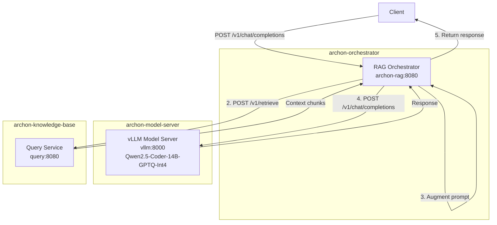

# Architecture

## System Design

ArchonAgent provides a transparent RAG proxy in front of vLLM. Clients send standard OpenAI chat completion requests; the orchestrator retrieves context from the Knowledge Base, augments the prompt, and forwards to vLLM.

### Component Separation

The system is deliberately split into two independent components deployed in separate namespaces:

**RAG Orchestrator** (`archon-orchestrator` namespace):
- Lightweight Python service (FastAPI + LangChain)
- Handles RAG logic: retrieval, prompt augmentation, request routing
- Minimal resource requirements (256-512Mi memory, 100-500m CPU)
- Can be updated independently without affecting model serving
- Scales horizontally for request handling

**vLLM Model Server** (`archon-model-server` namespace):
- GPU-intensive inference engine
- Requires dedicated GPU resources (1 GPU, 16-24Gi memory)
- Long startup time (model download and loading)
- Expensive to restart or scale
- Provides pure LLM inference without RAG logic

**Benefits of Separation:**
- **Independent scaling**: Scale orchestrator for request volume, model server for inference throughput
- **Independent updates**: Update RAG logic without restarting expensive GPU workloads
- **Resource isolation**: Orchestrator failures don't affect model server availability
- **Cost optimization**: Run multiple lightweight orchestrators with different RAG strategies against one model server
- **Namespace isolation**: Separate RBAC, resource quotas, and network policies per component

## Components

### RAG Orchestrator

FastAPI service using LangChain for RAG orchestration:

- **Image**: `ghcr.io/bdchatham/archon-rag-orchestrator:latest`
- **Port**: 8080
- **Resources**: 256-512Mi memory, 100-500m CPU
- **Framework**: FastAPI + LangChain + aphex-service-clients

**Components:**
- `KnowledgeBaseRetriever` - LangChain `BaseRetriever` wrapping `QueryClient`
- `RAGChain` - Orchestrates retrieval and prompt augmentation
- `ChatOpenAI` - LangChain wrapper for vLLM calls with streaming

**Key responsibilities:**
1. Parse incoming OpenAI chat completion requests
2. Extract user query from conversation
3. Retrieve context via `KnowledgeBaseRetriever` (uses `QueryClient` with retry)
4. Augment system prompt with retrieved context
5. Call vLLM via LangChain `ChatOpenAI`
6. Stream or return response in OpenAI format

**Source**
- `src/orchestrator/main.py`
- `src/orchestrator/rag_chain.py`
- `src/orchestrator/retriever.py`

### vLLM Model Server

GPU-accelerated inference engine:

- **Image**: `vllm/vllm-openai:v0.14.1-cu130`
- **RuntimeClass**: `nvidia` for GPU access
- **Resources**: 16-24Gi memory, 4-8 CPU cores, 1 GPU
- **Model**: Qwen2.5-Coder-14B-Instruct-GPTQ-Int4

### Configuration

**Orchestrator ConfigMap** (`archon-rag-config`):
- `KNOWLEDGE_BASE_URL`: KB query service URL
- `VLLM_URL`: vLLM service URL
- `RAG_ENABLED`: Enable/disable RAG augmentation
- `RAG_CONTEXT_CHUNKS`: Number of chunks to retrieve
- `RAG_SIMILARITY_THRESHOLD`: Minimum similarity score

**vLLM ConfigMap** (`vllm-config`):
- `llm_model`: HuggingFace model identifier
- `gpu_memory_utilization`: VRAM usage fraction
- `max_model_len`: Maximum context length

## Request Flow

1. **Client Request**: Standard OpenAI chat completion request arrives
2. **Query Extraction**: Orchestrator extracts the last user message
3. **Context Retrieval**: Orchestrator calls KB `/v1/retrieve` with the query
4. **Filtering**: Chunks below similarity threshold are discarded
5. **Prompt Augmentation**: Context is injected into system message
6. **LLM Inference**: Augmented request forwarded to vLLM
7. **Response**: vLLM response returned to client unchanged

## Graceful Degradation

The orchestrator degrades gracefully when dependencies are unavailable:

| Scenario | Behavior |
|----------|----------|
| KB unreachable | Forward to vLLM without augmentation |
| KB timeout (>10s) | Forward to vLLM without augmentation (after retries) |
| KB returns empty | Forward to vLLM without augmentation |
| vLLM unreachable | Return 503 Service Unavailable |

**Retry Behavior:**
The `QueryClient` from `aphex-service-clients` provides automatic retry with exponential backoff and jitter on transient failures (connection errors, timeouts).

## Technology Stack

- **FastAPI**: Async web framework for orchestrator
- **LangChain**: RAG orchestration, retriever abstraction, LLM wrapper
- **aphex-service-clients**: `QueryClient` with retry/backoff for Knowledge Base
- **vLLM**: High-throughput LLM serving engine
- **Qwen2.5-Coder-14B**: Code-optimized LLM
- **Kubernetes**: Container orchestration
- **ArgoCD**: GitOps deployment

## Dependencies

### Upstream Dependencies

- **ArchonKnowledgeBaseInfrastructure**: Provides `/v1/retrieve` for context retrieval
- **AphexServiceClients**: Provides `QueryClient` with retry logic
- **NVIDIA RuntimeClass**: Required for vLLM GPU access
- **nginx Ingress Controller**: For external access

### Downstream Dependencies

None - this is the top of the inference stack.

**Source**
- `src/orchestrator/main.py` - Orchestrator FastAPI app
- `src/orchestrator/rag_chain.py` - LangChain RAG logic
- `src/orchestrator/retriever.py` - LangChain retriever wrapping QueryClient
- `manifests/orchestrator/` - Orchestrator Kubernetes manifests
- `manifests/model-server/` - vLLM Kubernetes manifests
