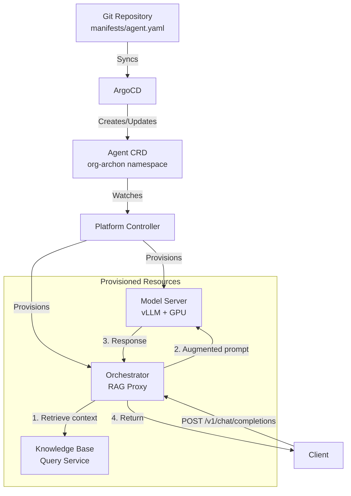

# Architecture

## System Design

ArchonAgent uses a **declarative CRD-based architecture**. The Agent CRD specifies desired configuration; the platform controller provisions and manages infrastructure.

### Agent CRD Model

```yaml
apiVersion: aphex.io/v1alpha1
kind: Agent
metadata:
  name: archon-assistant
  namespace: org-archon
spec:
  displayName: "Archon Assistant"
  model:
    provider: vllm
    name: Qwen/Qwen2.5-Coder-14B-Instruct-GPTQ-Int4
    quantization: gptq_marlin
    gpuCount: 1
  knowledgeBase:
    name: platform-docs
    namespace: archon-knowledge-base
  orchestration:
    image: ghcr.io/bdchatham/archon-rag-orchestrator:latest
    port: 8080
```

The platform controller watches this CRD and provisions:
- Model server deployment (vLLM with GPU)
- Orchestrator deployment (if `spec.orchestration` is set)
- Services and networking
- ConfigMaps with environment configuration

### Data Flow



## Components

### Agent CRD

Declarative configuration for the agent:

**Required fields:**
- `spec.displayName` - Human-readable name
- `spec.model.provider` - Model provider (vllm, openai, anthropic, bedrock)
- `spec.model.name` - Model identifier

**Optional fields:**
- `spec.model.quantization` - Quantization method (gptq_marlin, awq, fp16)
- `spec.model.gpuCount` - Number of GPUs to allocate
- `spec.model.image` - Container image for model server
- `spec.model.port` - Model server port
- `spec.knowledgeBase` - Reference to KnowledgeBase CRD for RAG
- `spec.orchestration` - Enable orchestrator for unified RAG endpoint

**Source**
- `manifests/agent.yaml` - Agent CRD manifest
- Platform controller API types (in AphexPlatformInfrastructure)

### Platform Controller

Kubernetes controller that reconciles Agent CRDs:

**Reconciliation logic:**
1. Watch for Agent CRD create/update/delete events
2. Provision model server deployment with GPU resources
3. Provision orchestrator deployment (if `spec.orchestration` is set)
4. Create services and ConfigMaps
5. Update Agent status with deployment state

**Status tracking:**
- `status.phase` - Current state (Pending, Ready, Failed)
- `status.modelServer.deployed` - Model server deployment status
- `status.modelServer.serviceURL` - Internal service URL
- `status.orchestrator.deployed` - Orchestrator deployment status (if enabled)

**Source**
- Platform controller in AphexPlatformInfrastructure

### RAG Orchestrator

FastAPI service using LangChain for RAG orchestration:

- **Image**: `ghcr.io/bdchatham/archon-rag-orchestrator:latest`
- **Port**: 8080 (configurable via `spec.orchestration.port`)
- **Resources**: 256-512Mi memory, 100-500m CPU
- **Framework**: FastAPI + LangChain + aphex-service-clients

**Components:**
- `KnowledgeBaseRetriever` - LangChain `BaseRetriever` wrapping `QueryClient`
- `RAGChain` - Orchestrates retrieval and prompt augmentation
- `ChatOpenAI` - LangChain wrapper for vLLM calls with streaming

**Key responsibilities:**
1. Parse incoming OpenAI chat completion requests
2. Extract user query from conversation
3. Retrieve context via `KnowledgeBaseRetriever` (uses `QueryClient` with retry)
4. Augment system prompt with retrieved context
5. Call vLLM via LangChain `ChatOpenAI`
6. Stream or return response in OpenAI format

**Source**
- `src/orchestrator/main.py`
- `src/orchestrator/rag_chain.py`
- `src/orchestrator/retriever.py`

### vLLM Model Server

GPU-accelerated inference engine:

- **Image**: `vllm/vllm-openai:v0.14.1-cu130` (configurable via `spec.model.image`)
- **RuntimeClass**: `nvidia` for GPU access
- **Resources**: Configured based on `spec.model.gpuCount`
- **Model**: Specified by `spec.model.name`

**Configuration:**
- Model name from `spec.model.name`
- Quantization from `spec.model.quantization`
- GPU count from `spec.model.gpuCount`
- Port from `spec.model.port` (default: 8000)

**Source**
- Platform controller provisions deployment based on Agent CRD

## Request Flow

1. **Client Request**: Standard OpenAI chat completion request arrives at orchestrator
2. **Query Extraction**: Orchestrator extracts the last user message
3. **Context Retrieval**: Orchestrator calls KB `/v1/retrieve` with the query
4. **Filtering**: Chunks below similarity threshold are discarded
5. **Prompt Augmentation**: Context is injected into system message
6. **LLM Inference**: Augmented request forwarded to vLLM
7. **Response**: vLLM response returned to client unchanged

## Graceful Degradation

The orchestrator degrades gracefully when dependencies are unavailable:

| Scenario | Behavior |
|----------|----------|
| KB unreachable | Forward to vLLM without augmentation |
| KB timeout (>10s) | Forward to vLLM without augmentation (after retries) |
| KB returns empty | Forward to vLLM without augmentation |
| vLLM unreachable | Return 503 Service Unavailable |

**Retry Behavior:**
The `QueryClient` from `aphex-service-clients` provides automatic retry with exponential backoff and jitter on transient failures.

## Technology Stack

- **Kubernetes CRDs**: Declarative agent configuration
- **Platform Controller**: Reconciles Agent CRDs to infrastructure
- **FastAPI**: Async web framework for orchestrator
- **LangChain**: RAG orchestration, retriever abstraction, LLM wrapper
- **aphex-service-clients**: `QueryClient` with retry/backoff for Knowledge Base
- **vLLM**: High-throughput LLM serving engine
- **Qwen2.5-Coder-14B**: Code-optimized LLM
- **ArgoCD**: GitOps deployment

## Dependencies

### Upstream Dependencies

- **AphexPlatformInfrastructure**: Provides Agent CRD and platform controller
- **ArchonKnowledgeBaseInfrastructure**: Provides `/v1/retrieve` for context retrieval
- **AphexServiceClients**: Provides `QueryClient` with retry logic
- **NVIDIA RuntimeClass**: Required for vLLM GPU access

### Downstream Dependencies

None - this is the top of the inference stack.

**Source**
- `manifests/agent.yaml` - Agent CRD manifest
- `src/orchestrator/main.py` - Orchestrator FastAPI app
- `src/orchestrator/rag_chain.py` - LangChain RAG logic
- `src/orchestrator/retriever.py` - LangChain retriever wrapping QueryClient
