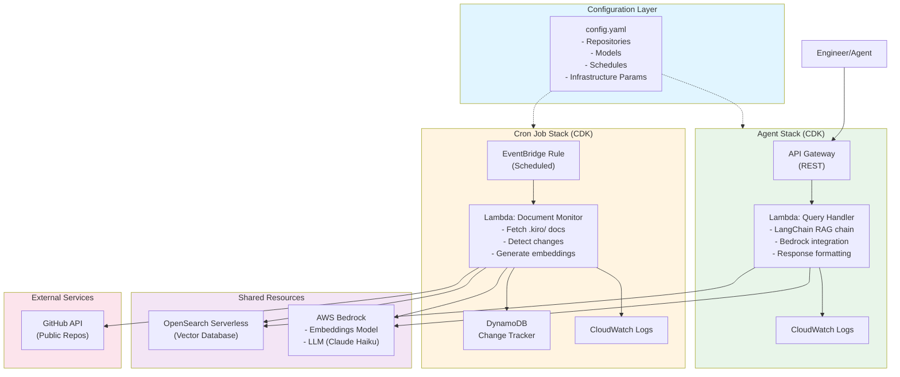
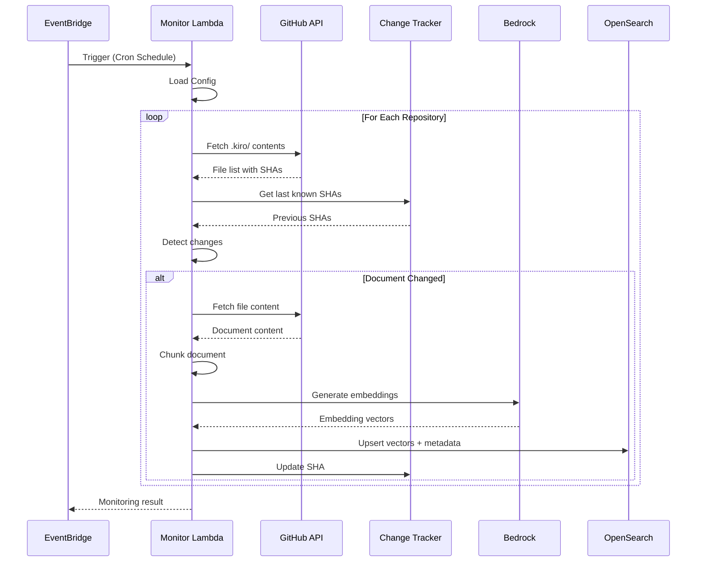
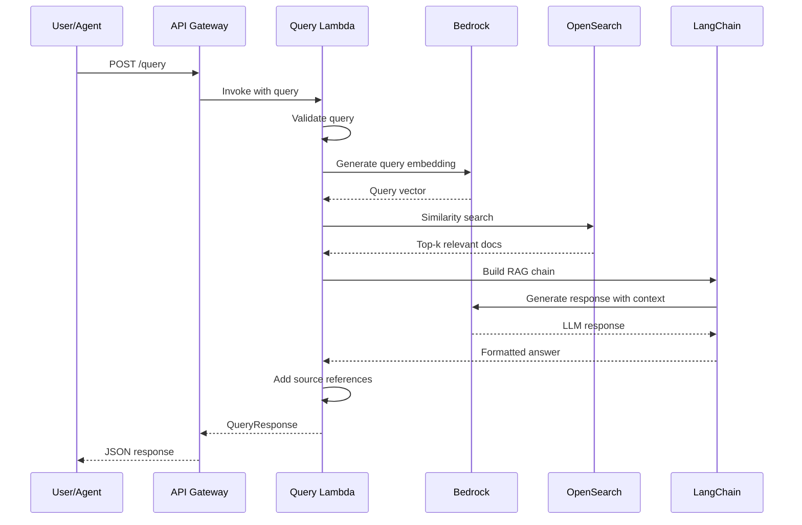

# Design Document

## Overview

Archon is a production-grade RAG-based system documentation chat bot that monitors .kiro/ documentation in public GitHub repositories and provides intelligent query capabilities for engineers and agents. The system consists of two independent CloudFormation stacks: a Cron Job Stack for asynchronous document ingestion and an Agent Stack for query processing. The architecture leverages AWS Bedrock for embeddings and language model inference, LangChain for RAG orchestration, and AWS CDK (TypeScript) for infrastructure as code.

The system follows a configuration-driven approach where repository sources and infrastructure parameters are defined in static YAML/JSON files, enabling declarative infrastructure management and easy extensibility for future enhancements like code crawling.

**AWS Best Practices:** The infrastructure implementation follows AWS Well-Architected Framework principles including operational excellence, security, reliability, performance efficiency, and cost optimization. CDK constructs should leverage AWS best practices for serverless architectures, least-privilege IAM policies, and proper resource tagging.

## Architecture

### High-Level Architecture



### Stack Separation

**Cron Job Stack:**
- EventBridge scheduled rule
- Lambda function for document monitoring
- DynamoDB table for change tracking
- IAM roles and policies
- CloudWatch log groups

**Agent Stack:**
- API Gateway REST API
- Lambda function for query processing
- IAM roles and policies
- CloudWatch log groups

**Shared Resources:**
- OpenSearch Serverless collection (vector database)
- AWS Bedrock access (managed service)
- VPC and networking (if required)

### Document Ingestion Flow



### Query Processing Flow



### Technology Stack

- **Infrastructure:** AWS CDK (TypeScript)
- **Compute:** AWS Lambda (Python 3.11)
- **Orchestration:** LangChain
- **Vector Database:** Amazon OpenSearch Serverless
- **Embeddings:** AWS Bedrock (amazon.titan-embed-text-v1)
- **LLM:** AWS Bedrock (anthropic.claude-3-haiku-20240307)
- **API:** Amazon API Gateway (REST)
- **Scheduling:** Amazon EventBridge
- **State Management:** Amazon DynamoDB
- **Configuration:** YAML files
- **GitHub Integration:** PyGithub library

## Components and Interfaces

### 1. Configuration Manager

**Purpose:** Load and validate configuration from static YAML files

**Interface:**
```python
class ConfigManager:
    def load_config(self, config_path: str) -> Config
    def validate_config(self, config: Config) -> bool
    def get_repositories(self) -> List[RepositoryConfig]
    def get_infrastructure_params(self) -> InfrastructureConfig
    def get_model_config(self) -> ModelConfig
```

**Configuration Schema:**
```yaml
version: "1.0"
repositories:
  - url: "https://github.com/org/repo1"
    branch: "main"
    paths: [".kiro/"]
  - url: "https://github.com/org/repo2"
    branch: "main"
    paths: [".kiro/"]

infrastructure:
  cron_schedule: "rate(1 hour)"
  lambda_memory: 1024
  lambda_timeout: 300
  vector_db_dimensions: 1536

models:
  embedding_model: "amazon.titan-embed-text-v1"
  llm_model: "anthropic.claude-3-haiku-20240307"
  llm_temperature: 0.7
  max_tokens: 2048
  retrieval_k: 5
```

### 2. Document Monitor (Cron Job Lambda)

**Purpose:** Periodically check configured repositories for .kiro/ document changes

**Interface:**
```python
class DocumentMonitor:
    def __init__(self, config: Config, github_client: GitHubClient, 
                 change_tracker: ChangeTracker, ingestion_pipeline: IngestionPipeline)
    
    def execute(self) -> MonitoringResult
    def fetch_repository_contents(self, repo: RepositoryConfig) -> List[Document]
    def detect_changes(self, documents: List[Document]) -> List[Document]
    def process_changed_documents(self, documents: List[Document]) -> None
```

**Handler:**
```python
def lambda_handler(event, context):
    # Load configuration
    # Initialize components
    # Execute monitoring
    # Return results
```

### 3. GitHub Client

**Purpose:** Interface with GitHub API to retrieve repository contents using PyGithub library

**Implementation Note:** Uses PyGithub (https://github.com/PyGithub/PyGithub) for GitHub API interactions, which provides built-in rate limiting, pagination, error handling, and authentication support.

**Interface:**
```python
class GitHubClient:
    def __init__(self, access_token: Optional[str] = None)
    # Wraps PyGithub's Github class
    # PyGithub handles rate limiting automatically
    
    def get_directory_contents(self, repo_url: str, path: str, branch: str) -> List[FileMetadata]
    # Uses repo.get_contents() from PyGithub
    
    def get_file_content(self, repo_url: str, file_path: str, branch: str) -> str
    # Uses repo.get_contents().decoded_content from PyGithub
    
    def get_file_sha(self, repo_url: str, file_path: str, branch: str) -> str
    # Uses repo.get_contents().sha from PyGithub
    
    def validate_repository_access(self, repo_url: str) -> bool
    # Uses repo.get_repo() to verify access
```

### 4. Change Tracker

**Purpose:** Track document versions to detect changes

**Interface:**
```python
class ChangeTracker:
    def __init__(self, dynamodb_table: str)
    
    def get_last_known_sha(self, repo: str, file_path: str) -> Optional[str]
    def update_sha(self, repo: str, file_path: str, sha: str, timestamp: datetime) -> None
    def has_changed(self, repo: str, file_path: str, current_sha: str) -> bool
```

**DynamoDB Schema:**
```
Table: archon-document-tracker
Partition Key: repo_file_path (String) - format: "{repo_url}#{file_path}"
Attributes:
  - sha (String)
  - last_modified (String - ISO timestamp)
  - last_checked (String - ISO timestamp)
  - content_hash (String)
```

### 5. Ingestion Pipeline

**Purpose:** Process documents and store in vector database

**Interface:**
```python
class IngestionPipeline:
    def __init__(self, embeddings: Embeddings, vector_store: VectorStore)
    
    def ingest_document(self, document: Document) -> None
    def generate_embeddings(self, text: str) -> List[float]
    def chunk_document(self, document: Document) -> List[DocumentChunk]
    def store_embeddings(self, chunks: List[DocumentChunk], embeddings: List[List[float]]) -> None
```

**Document Chunking Strategy:**
- Chunk size: 1000 characters
- Chunk overlap: 200 characters
- Preserve markdown structure
- Use LangChain RecursiveCharacterTextSplitter

### 6. Vector Store Manager

**Purpose:** Interface with OpenSearch Serverless for vector operations

**Interface:**
```python
class VectorStoreManager:
    def __init__(self, opensearch_endpoint: str, index_name: str)
    
    def create_index(self, dimensions: int) -> None
    def upsert_vectors(self, vectors: List[VectorDocument]) -> None
    def similarity_search(self, query_vector: List[float], k: int) -> List[Document]
    def delete_by_source(self, repo: str, file_path: str) -> None
```

**Vector Document Schema:**
```python
{
    "id": "uuid",
    "vector": [float],  # 1536 dimensions for Titan embeddings
    "metadata": {
        "repo_url": str,
        "file_path": str,
        "chunk_index": int,
        "last_modified": str,
        "document_type": "kiro_doc",
        "source_type": "github"
    },
    "text": str
}
```

### 7. Query Handler (Agent Lambda)

**Purpose:** Process user queries using RAG pipeline

**Interface:**
```python
class QueryHandler:
    def __init__(self, rag_chain: RetrievalQA, config: Config)
    
    def handle_query(self, query: str) -> QueryResponse
    def validate_query(self, query: str) -> bool
    def format_response(self, llm_response: str, sources: List[Document]) -> QueryResponse
```

**API Gateway Integration:**
```
POST /query
Request:
{
    "query": "How does the authentication system work?",
    "max_results": 5  # optional
}

Response:
{
    "answer": "The authentication system uses...",
    "sources": [
        {
            "repo": "github.com/org/repo1",
            "file_path": ".kiro/architecture/auth.md",
            "relevance_score": 0.92
        }
    ],
    "timestamp": "2025-12-09T10:30:00Z"
}
```

### 8. RAG Chain

**Purpose:** Orchestrate retrieval and generation using LangChain

**Interface:**
```python
class ArchonRAGChain:
    def __init__(self, llm: Bedrock, retriever: VectorStoreRetriever, 
                 prompt_template: PromptTemplate)
    
    def invoke(self, query: str) -> Dict[str, Any]
    def get_relevant_documents(self, query: str) -> List[Document]
    def generate_response(self, query: str, context: List[Document]) -> str
```

**Prompt Template:**
```
You are Archon, a system engineering expert assistant. Your role is to help engineers 
and agents understand product architecture by providing accurate information from 
documentation.

Context from documentation:
{context}

Question: {question}

Provide a clear, accurate answer based on the documentation. If the documentation 
doesn't contain enough information to answer fully, acknowledge this. Always cite 
the specific documents you reference.

Answer:
```

### 9. CDK Infrastructure

**Purpose:** Define and deploy AWS infrastructure using TypeScript CDK following AWS Well-Architected Framework best practices

**AWS Best Practices:**
- Use least-privilege IAM policies with specific resource ARNs
- Enable CloudWatch logging and monitoring for all resources
- Apply consistent resource tagging (Environment, Project, Owner)
- Use AWS managed policies where appropriate
- Enable encryption at rest and in transit
- Implement proper VPC configuration for OpenSearch if required
- Use CDK aspects for cross-cutting concerns (tagging, compliance)
- Follow serverless best practices for Lambda (memory sizing, timeout configuration, environment variables)

**Structure:**
```typescript
// lib/config-loader.ts
export class ConfigLoader {
  static loadConfig(configPath: string): ArchonConfig
}

// lib/cron-stack.ts
export class ArchonCronStack extends Stack {
  constructor(scope: Construct, id: string, config: ArchonConfig)
  // Creates: EventBridge, Lambda, DynamoDB, IAM
  // Applies: Resource tags, CloudWatch alarms, least-privilege IAM
}

// lib/agent-stack.ts
export class ArchonAgentStack extends Stack {
  constructor(scope: Construct, id: string, config: ArchonConfig)
  // Creates: API Gateway, Lambda, IAM
  // Applies: Resource tags, CloudWatch alarms, API throttling
}

// lib/shared-resources.ts
export class ArchonSharedResources extends Stack {
  constructor(scope: Construct, id: string, config: ArchonConfig)
  // Creates: OpenSearch Serverless collection
  // Applies: Encryption, access policies, resource tags
}

// bin/archon.ts
const app = new App();
const config = ConfigLoader.loadConfig('./config/config.yaml');

new ArchonSharedResources(app, 'ArchonShared', config);
new ArchonCronStack(app, 'ArchonCron', config);
new ArchonAgentStack(app, 'ArchonAgent', config);
```

## Data Models

### Document
```python
@dataclass
class Document:
    repo_url: str
    file_path: str
    content: str
    sha: str
    last_modified: datetime
    document_type: str = "kiro_doc"
    source_type: str = "github"
```

### DocumentChunk
```python
@dataclass
class DocumentChunk:
    document: Document
    chunk_index: int
    text: str
    start_char: int
    end_char: int
```

### RepositoryConfig
```python
@dataclass
class RepositoryConfig:
    url: str
    branch: str
    paths: List[str]
```

### QueryResponse
```python
@dataclass
class QueryResponse:
    answer: str
    sources: List[SourceReference]
    timestamp: datetime
    query: str
```

### SourceReference
```python
@dataclass
class SourceReference:
    repo: str
    file_path: str
    relevance_score: float
    chunk_text: Optional[str] = None
```

### MonitoringResult
```python
@dataclass
class MonitoringResult:
    repositories_checked: int
    documents_processed: int
    documents_updated: int
    errors: List[str]
    execution_time: float
```

## Correctness Properties

*A property is a characteristic or behavior that should hold true across all valid executions of a system—essentially, a formal statement about what the system should do. Properties serve as the bridge between human-readable specifications and machine-verifiable correctness guarantees.*


### Configuration and Repository Management

Property 1: Configuration parsing completeness
*For any* valid YAML/JSON configuration file, parsing should successfully extract all repository configurations with their URLs, branches, and paths
**Validates: Requirements 1.1**

Property 2: GitHub URL validation
*For any* string input, the URL validator should correctly identify valid GitHub repository URLs and reject invalid formats
**Validates: Requirements 1.2**

Property 3: Independent repository processing
*For any* list of repository configurations, processing should handle each repository independently such that failure in one does not prevent processing of others
**Validates: Requirements 1.4**

Property 4: Error isolation in multi-repository monitoring
*For any* set of repositories containing both valid and invalid URLs, the system should process all valid repositories and log errors for invalid ones without terminating
**Validates: Requirements 1.5**

### Document Monitoring and Change Detection

Property 5: Complete repository scanning
*For any* list of configured repositories, the monitor should check each repository exactly once per execution
**Validates: Requirements 3.1**

Property 6: Document content extraction
*For any* detected document change, the system should successfully extract the complete file content
**Validates: Requirements 3.3**

Property 7: Monitoring result completeness
*For any* monitoring execution, the result should include counts of repositories checked, documents processed, and any errors encountered
**Validates: Requirements 3.4**

Property 8: API error resilience
*For any* GitHub API error (rate limit, timeout, etc.), the system should handle the error gracefully without crashing and continue processing other repositories
**Validates: Requirements 3.5**

### Embedding Generation and Storage

Property 9: Embedding dimension consistency
*For any* document text, generated embeddings should have the configured dimension size (1536 for Titan)
**Validates: Requirements 4.1**

Property 10: Metadata completeness in vector storage
*For any* document stored in the vector database, the metadata should include repo_url, file_path, and last_modified timestamp
**Validates: Requirements 4.2, 4.3**

Property 11: Document update replaces previous version
*For any* document with the same repo_url and file_path, storing a new version should replace the existing entry rather than creating a duplicate
**Validates: Requirements 4.4**

Property 12: Embedding generation retry with backoff
*For any* embedding generation failure, the system should retry with exponentially increasing delays and log the failure after exhausting retries
**Validates: Requirements 4.5**

### Query Processing and Validation

Property 13: Query input validation
*For any* input string, the query validator should correctly identify valid queries (non-empty, reasonable length) and reject invalid ones
**Validates: Requirements 5.2**

Property 14: Invalid query error responses
*For any* invalid or empty query input, the system should return an error response with a helpful message explaining the issue
**Validates: Requirements 5.4**

Property 15: Query embedding generation
*For any* valid query string, the system should generate an embedding vector with the correct dimensions matching the document embeddings
**Validates: Requirements 6.1**

Property 16: Similarity search ordering
*For any* query embedding, similarity search results should be ordered by relevance score in descending order
**Validates: Requirements 6.2**

Property 17: Context inclusion in LLM prompt
*For any* set of retrieved documents, all documents should appear in the context section of the LLM prompt
**Validates: Requirements 6.3**

Property 18: Source reference completeness
*For any* query response, each source reference should include both repository URL and file path
**Validates: Requirements 6.5**

### Security and Access Control

Property 19: Public repository restriction
*For any* repository URL in the configuration, the system should only process repositories that are publicly accessible
**Validates: Requirements 9.1**

Property 20: Permission error handling
*For any* repository access failure due to permissions, the system should log the error and skip that repository without crashing
**Validates: Requirements 9.2**

Property 21: Rate limit compliance
*For any* sequence of GitHub API requests, the rate limiter should prevent exceeding the configured API rate limits
**Validates: Requirements 9.3**

Property 22: Credential exclusion from storage
*For any* document stored in the vector database, the metadata and content should not contain authentication credentials or tokens
**Validates: Requirements 9.4**

### Extensibility

Property 23: Document type metadata presence
*For any* document stored in the knowledge base, the metadata should include both document_type and source_type fields
**Validates: Requirements 10.3**

## Error Handling

### GitHub API Errors

- **Rate Limiting:** Implement exponential backoff with jitter. Use conditional requests with ETags to minimize API calls.
- **Network Timeouts:** Retry up to 3 times with increasing delays (1s, 2s, 4s).
- **404 Not Found:** Log warning and skip the file/repository. Do not fail the entire job.
- **403 Forbidden:** Log error indicating permission issue. Skip repository and continue.
- **Authentication Failures:** For public repos, should not occur. Log error if it does.

### AWS Service Errors

- **Bedrock Throttling:** Implement exponential backoff. Consider batching requests where possible.
- **OpenSearch Connection Errors:** Retry with exponential backoff. Log error after 3 failed attempts.
- **DynamoDB Throttling:** Use exponential backoff with jitter. Consider using batch operations.
- **Lambda Timeouts:** Ensure processing is chunked appropriately. Log progress before timeout.

### Data Processing Errors

- **Invalid Document Format:** Log warning with file path. Skip document and continue.
- **Embedding Generation Failure:** Retry up to 3 times. Log error and skip document if all retries fail.
- **Document Chunking Errors:** Log error with document details. Skip document and continue.
- **Vector Storage Failures:** Retry with exponential backoff. Log error after exhausting retries.

### Configuration Errors

- **Invalid YAML/JSON:** Fail fast at startup with clear error message.
- **Missing Required Fields:** Fail fast at startup with validation error.
- **Invalid Repository URLs:** Log warning and skip invalid repositories. Continue with valid ones.
- **Invalid Model Names:** Fail fast at startup with clear error message.

### Error Response Format

All API errors should follow this structure:
```json
{
    "error": {
        "code": "INVALID_QUERY",
        "message": "Query cannot be empty",
        "details": "Please provide a non-empty query string"
    },
    "timestamp": "2025-12-09T10:30:00Z"
}
```

## Testing Strategy

### Unit Testing

Unit tests will verify specific functionality of individual components:

- **Configuration Manager:** Test YAML/JSON parsing, validation, and error handling
- **GitHub Client:** Test URL parsing, API request formatting, rate limiting logic
- **Change Tracker:** Test SHA comparison, DynamoDB operations, change detection logic
- **Document Chunking:** Test chunk size, overlap, boundary conditions
- **Query Validation:** Test input validation rules, error message generation
- **Response Formatting:** Test JSON serialization, source reference formatting

Unit tests will use mocking for external services (GitHub API, AWS services) to ensure fast, reliable test execution.

### Property-Based Testing

Property-based tests will verify universal properties across many randomly generated inputs using the **Hypothesis** library for Python:

**Testing Framework:** Hypothesis (Python)
**Configuration:** Minimum 100 iterations per property test

Each property-based test will:
- Generate random valid inputs using Hypothesis strategies
- Execute the system behavior
- Assert that the correctness property holds
- Be tagged with a comment referencing the design document property

**Example Property Test Structure:**
```python
from hypothesis import given, strategies as st

# Feature: archon-rag-system, Property 2: GitHub URL validation
@given(st.text())
def test_url_validation_correctness(url_string):
    """For any string input, validator correctly identifies valid GitHub URLs"""
    result = validate_github_url(url_string)
    if result.is_valid:
        assert url_string.startswith("https://github.com/")
        assert len(url_string.split("/")) >= 5
    # Property: valid URLs must match GitHub format
```

**Key Property Test Areas:**
- Configuration parsing with various valid/invalid YAML structures
- URL validation with random strings
- Repository processing with various list sizes and error conditions
- Embedding dimension consistency across different text inputs
- Metadata completeness for randomly generated documents
- Query validation with various input strings
- Similarity search ordering with random query vectors
- Error handling with simulated failures

### Integration Testing

Integration tests will verify end-to-end workflows:

- **Document Ingestion Pipeline:** Deploy to test environment, trigger cron job, verify documents appear in OpenSearch
- **Query Processing:** Submit queries via API Gateway, verify responses include correct sources
- **Error Recovery:** Simulate GitHub API failures, verify system continues processing
- **Configuration Updates:** Update config file, redeploy, verify new repositories are monitored

### Infrastructure Testing

CDK infrastructure will be tested using:

- **CDK Assertions:** Verify CloudFormation templates contain expected resources
- **Stack Synthesis:** Ensure stacks can be synthesized without errors
- **Resource Validation:** Verify IAM policies follow least-privilege principle
- **Configuration Loading:** Test config file parsing in CDK context

### Performance Testing

- **Embedding Generation:** Measure time to generate embeddings for various document sizes
- **Vector Search:** Measure query latency for different knowledge base sizes
- **Cron Job Duration:** Ensure monitoring completes within Lambda timeout
- **API Response Time:** Verify query responses return within acceptable latency (< 5s)

### Test Data Strategy

- **Synthetic Documents:** Generate markdown documents with known content for testing
- **Mock GitHub Responses:** Use recorded API responses for consistent testing
- **Test Repositories:** Create dedicated test repositories with known .kiro/ structure
- **Vector Database:** Use separate OpenSearch collection for testing

## Deployment Strategy

### Environment Configuration

Three environments with separate configurations:

- **Development:** Single test repository, small Lambda sizes, verbose logging
- **Staging:** Subset of production repositories, production-like resources
- **Production:** All configured repositories, optimized resource allocation

### Deployment Process

1. **Configuration Validation:** Validate config.yaml syntax and required fields
2. **CDK Synthesis:** Generate CloudFormation templates from CDK code
3. **Stack Deployment Order:**
   - Deploy Shared Resources stack first (OpenSearch)
   - Deploy Cron Job stack
   - Deploy Agent stack
4. **Post-Deployment Verification:**
   - Verify OpenSearch collection is accessible
   - Test API Gateway endpoint
   - Trigger manual cron job execution
   - Submit test query

### Rollback Strategy

- **Stack-Level Rollback:** CloudFormation automatic rollback on failure
- **Configuration Rollback:** Revert config.yaml to previous version and redeploy
- **Data Rollback:** OpenSearch snapshots for knowledge base recovery

### Monitoring and Observability

- **CloudWatch Dashboards:** Monitor Lambda invocations, errors, duration
- **CloudWatch Alarms:** Alert on Lambda errors, API Gateway 5xx errors, DynamoDB throttling
- **X-Ray Tracing:** Trace requests through API Gateway → Lambda → Bedrock → OpenSearch
- **Custom Metrics:** Track documents processed, embeddings generated, query latency
- **Log Aggregation:** Centralize logs from all Lambda functions with structured logging

## Future Enhancements

### Code Crawling

The architecture is designed to support code crawling as a future enhancement:

- **Document Source Abstraction:** `source_type` field in metadata supports multiple source types
- **Pluggable Extractors:** Document extraction uses strategy pattern for different source types
- **Extended Metadata:** Schema accommodates code-specific metadata (language, file type, symbols)
- **Configuration Extension:** Config schema can be extended with code crawling parameters

### Potential Code Crawling Features

- Parse source code files (.py, .ts, .java, etc.)
- Extract function/class signatures and docstrings
- Index code comments and documentation
- Support semantic code search
- Link code to related .kiro/ documentation

### Multi-Modal Support

- Support for diagrams and images in documentation
- Vision model integration for diagram understanding
- Mermaid diagram parsing and indexing

### Advanced RAG Features

- Conversation history and follow-up questions
- Multi-turn dialogue with context retention
- Query refinement and clarification
- Hybrid search (keyword + semantic)
- Re-ranking of retrieved documents

### Collaboration Features

- User feedback on answer quality
- Thumbs up/down for responses
- Question history and analytics
- Popular questions dashboard
- Suggested questions based on documentation
