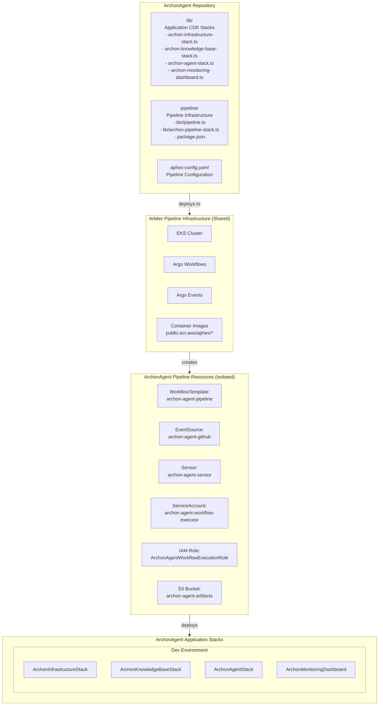
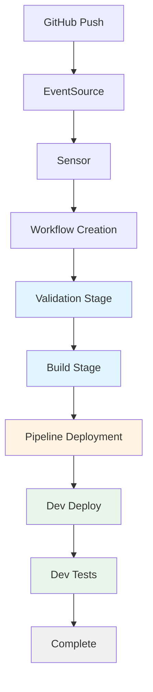

# Design Document: Deployment Automation Construct

## Overview

This design document describes the implementation of a deployment automation infrastructure for the ArchonAgent application using AWS CDK and the AphexPipeline construct. The system creates a fully automated CI/CD pipeline that runs on shared Kubernetes infrastructure (Arbiter Pipeline Infrastructure) and deploys ArchonAgent stacks to multiple AWS environments.

The solution consists of three main components:

1. **Pipeline Infrastructure Stack**: A CDK stack that instantiates the AphexPipelineStack construct, creating isolated pipeline resources on the shared cluster
2. **Configuration System**: A YAML-based configuration file that declaratively defines build commands, deployment environments, stack dependencies, and test stages
3. **Application Stacks**: The existing ArchonAgent CDK stacks (infrastructure, knowledge base, agent, monitoring) that will be deployed by the pipeline

The pipeline supports key features including:
- Automatic triggering via GitHub webhooks
- Multi-stage workflow execution (validate, build, deploy, test)
- Self-modification when configuration changes
- Artifact management with configurable retention
- Comprehensive monitoring and troubleshooting capabilities

**Initial Implementation Scope**: For cost-effective prototyping, the initial implementation will support a single dev environment. The architecture is designed to easily scale to staging and production environments in the future by simply adding them to the configuration file.

## Architecture

### High-Level Architecture



### Workflow Execution Flow



## Components and Interfaces

### 1. Pipeline Stack (ArchonPipelineStack)

**Purpose**: CDK stack that creates the pipeline infrastructure using the AphexPipelineStack construct.

**Location**: `pipeline/lib/archon-pipeline-stack.ts`

**Key Responsibilities**:
- Instantiate AphexPipelineStack construct with configuration
- Define pipeline resource names for isolation
- Configure GitHub integration parameters
- Set up artifact storage configuration
- Export pipeline outputs (webhook URL, bucket name)

**Interface**:
```typescript
export class ArchonPipelineStack extends cdk.Stack {
  constructor(scope: Construct, id: string, props?: cdk.StackProps);
}
```

**Configuration Parameters**:
- `clusterName`: Name of the shared EKS cluster
- `githubOwner`: GitHub organization or user
- `githubRepo`: Repository name
- `githubBranch`: Branch to monitor (default: 'main')
- `githubTokenSecretName`: AWS Secrets Manager secret name
- `workflowTemplateName`: Name for the WorkflowTemplate resource
- `eventSourceName`: Name for the EventSource resource
- `sensorName`: Name for the Sensor resource
- `artifactBucketName`: Base name for the S3 artifact bucket
- `artifactRetentionDays`: Number of days to retain artifacts

### 2. Pipeline CDK App

**Purpose**: Entry point for the pipeline infrastructure CDK application.

**Location**: `pipeline/bin/pipeline.ts`

**Key Responsibilities**:
- Initialize CDK app
- Instantiate ArchonPipelineStack
- Configure environment (account, region)
- Apply tags for resource management

**Interface**:
```typescript
#!/usr/bin/env node
const app = new cdk.App();
new ArchonPipelineStack(app, 'ArchonAgentPipelineStack', props);
app.synth();
```

### 3. Configuration File (aphex-config.yaml)

**Purpose**: Declarative configuration defining pipeline behavior.

**Location**: `aphex-config.yaml` (repository root)

**Schema**:
```yaml
version: string                    # Configuration schema version
build:
  commands: string[]               # Build stage commands
environments:
  - name: string                   # Environment identifier
    region: string                 # AWS region
    account: string                # AWS account ID
    stacks:
      - name: string               # Stack name
        path: string               # Path to stack file
        dependsOn?: string[]       # Stack dependencies
    tests?:
      commands: string[]           # Test commands
```

**Validation Rules**:
- Version must be "1.0"
- Build commands array must not be empty
- Each environment must have unique name
- Stack paths must reference valid TypeScript files
- Stack dependencies must reference existing stacks in same environment
- Account IDs must be 12-digit strings
- Regions must be valid AWS region identifiers

### 4. Workflow Template Generator

**Purpose**: Generates Argo WorkflowTemplate from configuration file.

**Responsibilities**:
- Parse aphex-config.yaml
- Generate workflow stages for each environment
- Create dependency relationships between stages
- Configure AWS credentials for each environment
- Set up artifact passing between stages

**Generated Stages**:
1. **Validation**: Validate config, credentials, CDK context
2. **Build**: Clone, install, build, test, upload artifacts
3. **Pipeline Deploy**: Deploy pipeline infrastructure updates
4. **Environment Deploy** (per environment): Download artifacts, deploy stacks
5. **Environment Test** (per environment): Run test commands

### 5. GitHub Integration

**Components**:
- **EventSource**: Receives GitHub webhook events
- **Sensor**: Filters events and triggers workflows
- **Webhook Secret**: Optional secret for webhook validation

**Event Flow**:
1. GitHub sends webhook on push
2. EventSource receives HTTP POST
3. EventSource publishes event to event bus
4. Sensor subscribes to event bus
5. Sensor filters by branch name
6. Sensor creates Workflow from WorkflowTemplate

### 6. IAM and Security

**Resources**:
- **Workflow Execution Role**: IAM role assumed by workflow pods
- **ServiceAccount**: Kubernetes service account with IRSA
- **Cross-Account Roles**: CDK bootstrap roles in target accounts

**Permissions Required**:
- S3: PutObject, GetObject on artifact bucket
- CloudFormation: Full access for stack operations
- IAM: PassRole for CloudFormation execution role
- STS: AssumeRole for cross-account deployments
- Secrets Manager: GetSecretValue for GitHub token
- ECR: Pull images for workflow containers

### 7. Artifact Storage

**S3 Bucket Structure**:
```
archon-agent-artifacts-{account}-{region}/
├── {commit-sha-1}/
│   ├── build-output.tar.gz
│   ├── node_modules.tar.gz
│   └── cdk.out/
├── {commit-sha-2}/
│   └── ...
```

**Lifecycle Policy**:
- Transition to Intelligent-Tiering after 30 days
- Delete objects after configured retention period
- Abort incomplete multipart uploads after 7 days

## Data Models

### Configuration Schema

```typescript
interface AphexConfig {
  version: string;
  build: BuildConfig;
  environments: EnvironmentConfig[];
}

interface BuildConfig {
  commands: string[];
}

interface EnvironmentConfig {
  name: string;
  region: string;
  account: string;
  stacks: StackConfig[];
  tests?: TestConfig;
}

interface StackConfig {
  name: string;
  path: string;
  dependsOn?: string[];
}

interface TestConfig {
  commands: string[];
}
```

### Pipeline Stack Props

```typescript
interface ArchonPipelineStackProps extends cdk.StackProps {
  // Inherits standard CDK stack props
  // Additional props passed to AphexPipelineStack construct
}
```

### Workflow Parameters

```typescript
interface WorkflowParameters {
  commitSha: string;
  repositoryUrl: string;
  branch: string;
  author: string;
  message: string;
}
```

### Stack Outputs

```typescript
interface StackOutputs {
  [key: string]: string;  // Output name -> Output value
}
```

## Correctness Properties

*A property is a characteristic or behavior that should hold true across all valid executions of a system—essentially, a formal statement about what the system should do. Properties serve as the bridge between human-readable specifications and machine-verifiable correctness guarantees.*


### Property Reflection

After analyzing all acceptance criteria, several properties can be consolidated:

- Properties 1.1, 1.3, 1.5, and 8.1 all verify the synthesized CloudFormation template structure - these can be combined into a comprehensive "Stack synthesis completeness" property
- Properties 2.2, 2.5, 4.1, 4.2, and 4.5 all verify WorkflowTemplate stage structure - these can be combined into "WorkflowTemplate stage completeness" property
- Properties 6.1, 6.2, and 6.5 all verify cross-account configuration - these can be combined into "Cross-account deployment configuration" property

This reduces redundancy while maintaining comprehensive validation coverage.

Property 1: Stack synthesis completeness
*For any* valid pipeline configuration, synthesizing the pipeline stack should produce a CloudFormation template containing an AphexPipelineStack construct, all required pipeline resources (WorkflowTemplate, EventSource, Sensor, ServiceAccount, IAM Role, S3 bucket), and all required stack outputs (webhook URL, artifact bucket name)
**Validates: Requirements 1.1, 1.3, 1.5, 8.1**

Property 2: Configuration parameter acceptance
*For any* valid configuration parameters (cluster name, GitHub details, resource names), the AphexPipelineStack construct should instantiate without errors and store all parameters correctly
**Validates: Requirements 1.2**

Property 3: Cluster reference correctness
*For any* pipeline configuration with a specified cluster name, all generated Kubernetes resources should reference that exact cluster name
**Validates: Requirements 1.4**

Property 4: Configuration schema validation
*For any* configuration file, the validator should accept it if and only if it has valid version, non-empty build commands, valid environments with required fields, and valid stack dependency references
**Validates: Requirements 2.1, 2.3**

Property 5: Stack dependency ordering
*For any* set of stacks with dependency relationships, the deployment order should respect the topological sort of the dependency graph (no stack deploys before its dependencies)
**Validates: Requirements 2.4**

Property 6: WorkflowTemplate stage completeness
*For any* valid configuration, the generated WorkflowTemplate should contain all required stages (validation, build, pipeline deployment, environment deployments, environment tests) with all required steps in each stage
**Validates: Requirements 2.2, 2.5, 4.1, 4.2, 4.5**

Property 7: Sensor configuration correctness
*For any* configured branch name, the generated Sensor should filter for that branch and include parameter mappings for commit SHA and repository information
**Validates: Requirements 3.3, 3.4**

Property 8: Stage execution ordering
*For any* configuration with one or more environments, the WorkflowTemplate stages should appear in order: validation, build, pipeline deployment, then for each environment in config order: deploy, test (if defined)
**Validates: Requirements 4.3, 4.4**

Property 9: Test stage generation
*For any* environment configuration, a test stage should exist immediately after the deployment stage if and only if the environment defines test commands
**Validates: Requirements 5.1**

Property 10: Test command ordering
*For any* environment with test commands, the test stage should execute commands in the same order as specified in the configuration
**Validates: Requirements 5.2**

Property 11: Workflow failure propagation
*For any* WorkflowTemplate stage, if that stage is configured to fail on error, then subsequent stages should have dependencies preventing their execution when the stage fails
**Validates: Requirements 5.3, 5.4**

Property 12: Cross-account deployment configuration
*For any* environment with a different AWS account than the pipeline account, the deployment stage should include role assumption steps using the CDK bootstrap role ARN format for that account, and should set AWS credentials specific to that environment
**Validates: Requirements 6.1, 6.2, 6.5**

Property 13: Stack output capture
*For any* deployment stage, the stage should include steps to capture and store CloudFormation stack outputs
**Validates: Requirements 6.4**

Property 14: Self-modification capability
*For any* pipeline deployment stage, it should include steps to regenerate the WorkflowTemplate from configuration and apply it to the cluster, with proper failure handling
**Validates: Requirements 7.2, 7.3, 7.5**

Property 15: Artifact organization
*For any* build stage, artifact upload steps should use S3 keys that include the commit SHA parameter
**Validates: Requirements 8.2**

Property 16: Artifact lifecycle policy
*For any* configured retention period, the S3 bucket should have lifecycle rules that delete objects after that many days
**Validates: Requirements 8.3**

Property 17: Artifact download consistency
*For any* deployment stage, the artifact download step should use the same commit SHA parameter as the build stage upload
**Validates: Requirements 8.4**

## Error Handling

### Configuration Validation Errors

**Scenario**: Invalid aphex-config.yaml file

**Handling**:
- Validation stage fails immediately with descriptive error message
- Error message includes specific validation failures (missing fields, invalid values, etc.)
- Workflow stops before build stage
- No resources are modified

**Example Errors**:
- "Missing required field: environments[0].region"
- "Invalid AWS account ID format: must be 12 digits"
- "Stack dependency not found: DatabaseStack depends on NonExistentStack"
- "Circular dependency detected: StackA → StackB → StackA"

### Build Failures

**Scenario**: Build commands fail (npm install, npm build, tests)

**Handling**:
- Build stage fails with exit code from failed command
- Build logs captured and available in Argo UI
- Workflow stops before deployment stages
- No deployments occur
- Artifacts are not uploaded to S3

**Recovery**: Fix build issues and push new commit

### Deployment Failures

**Scenario**: CloudFormation stack deployment fails

**Handling**:
- Deployment stage fails with CloudFormation error
- CloudFormation events preserved for troubleshooting
- Workflow stops before subsequent environments
- Failed stack may be in ROLLBACK_COMPLETE state
- Subsequent environments are not deployed

**Recovery Options**:
1. Fix issue and push new commit (recommended)
2. Manually delete failed stack and retry
3. Manually fix stack and continue

### Cross-Account Access Failures

**Scenario**: Cannot assume role in target account

**Handling**:
- Deployment stage fails with STS AssumeRole error
- Error message includes role ARN and account
- Workflow stops before stack deployment
- No resources created in target account

**Common Causes**:
- Target account not bootstrapped
- Trust relationship not configured
- IAM permissions insufficient

**Recovery**: Fix IAM configuration and push new commit

### Test Failures

**Scenario**: Post-deployment tests fail

**Handling**:
- Test stage fails with exit code from failed test
- Test logs captured and available
- Workflow stops before subsequent environments
- Deployed stacks remain in place (not rolled back)
- Subsequent environments are not deployed

**Recovery Options**:
1. Fix test issues and push new commit
2. Manually rollback deployed stacks if needed
3. Investigate deployed environment for issues

### Self-Modification Failures

**Scenario**: Pipeline deployment stage fails to update WorkflowTemplate

**Handling**:
- Pipeline deployment stage fails with kubectl error
- Previous WorkflowTemplate remains unchanged
- Workflow stops before environment deployments
- Next workflow execution uses old topology

**Common Causes**:
- Invalid WorkflowTemplate YAML generated
- Kubernetes API server unreachable
- Insufficient RBAC permissions

**Recovery**: Fix configuration and push new commit

### Artifact Upload/Download Failures

**Scenario**: S3 operations fail

**Handling**:
- Stage fails with S3 error message
- Workflow stops at failed stage
- Partial artifacts may exist in S3

**Common Causes**:
- IAM permissions insufficient
- S3 bucket not accessible
- Network connectivity issues

**Recovery**: Fix IAM/network issues and push new commit

## Testing Strategy

### Unit Testing

Unit tests will verify specific components and edge cases:

**Configuration Validation**:
- Valid configuration files are accepted
- Invalid configurations are rejected with appropriate errors
- Edge cases: empty arrays, missing optional fields, boundary values

**Stack Synthesis**:
- Pipeline stack synthesizes without errors
- Generated CloudFormation template has expected structure
- Stack outputs are correctly defined

**Dependency Resolution**:
- Simple dependency chains are ordered correctly
- Complex dependency graphs are topologically sorted
- Circular dependencies are detected and rejected

**Resource Naming**:
- Resource names follow expected patterns
- Names are properly isolated per pipeline
- Names handle special characters correctly

### Property-Based Testing

Property-based tests will verify universal properties across all inputs using the Hypothesis library for Python:

**Test Configuration**:
- Each property test will run a minimum of 100 iterations
- Tests will use custom generators for valid configurations
- Tests will be tagged with the property number and text from this design document

**Property Test Implementation**:
Each correctness property listed above will be implemented as a single property-based test. Tests will:
- Generate random valid inputs (configurations, parameters, etc.)
- Execute the system behavior (synthesis, validation, generation)
- Assert the property holds for the generated output

**Example Property Test Structure**:
```python
from hypothesis import given, strategies as st
import pytest

@given(st.builds(PipelineConfig, ...))
def test_property_1_stack_synthesis_completeness(config):
    """
    Feature: deployment-automation-construct, Property 1: Stack synthesis completeness
    
    For any valid pipeline configuration, synthesizing the pipeline stack 
    should produce a CloudFormation template containing an AphexPipelineStack 
    construct, all required pipeline resources, and all required stack outputs.
    """
    # Synthesize stack with config
    template = synthesize_pipeline_stack(config)
    
    # Assert all required resources present
    assert has_aphex_pipeline_construct(template)
    assert has_workflow_template(template)
    assert has_event_source(template)
    assert has_sensor(template)
    assert has_service_account(template)
    assert has_iam_role(template)
    assert has_s3_bucket(template)
    
    # Assert all required outputs present
    assert has_output(template, "WebhookUrl")
    assert has_output(template, "ArtifactBucketName")
```

**Custom Generators**:
Property tests will use custom Hypothesis strategies to generate:
- Valid pipeline configurations with random parameters
- Valid environment configurations with random regions/accounts
- Valid stack configurations with random dependencies (acyclic)
- Valid build/test command arrays
- Valid AWS account IDs (12-digit strings)
- Valid AWS region identifiers

**Edge Case Coverage**:
Generators will include edge cases:
- Minimum/maximum number of environments
- Minimum/maximum number of stacks per environment
- Empty vs non-empty test commands
- Same account vs different accounts
- Simple vs complex dependency graphs

### Integration Testing

Integration tests will verify end-to-end workflows:

**Pipeline Deployment**:
- Deploy pipeline stack to test AWS account
- Verify all Kubernetes resources created
- Verify S3 bucket created with correct policies
- Verify IAM roles created with correct permissions

**Workflow Execution**:
- Trigger workflow manually
- Verify all stages execute in correct order
- Verify artifacts uploaded and downloaded correctly
- Verify stacks deployed to test environments

**Self-Modification**:
- Deploy pipeline with initial configuration
- Update configuration and trigger workflow
- Verify WorkflowTemplate updated
- Verify next workflow uses new topology

**Cross-Account Deployment**:
- Configure environment in different AWS account
- Verify role assumption works
- Verify stacks deployed to target account
- Verify outputs captured correctly

### Test Environment Setup

**Requirements**:
- AWS account for pipeline infrastructure
- AWS account for test deployments (can be same as pipeline account)
- EKS cluster with Argo Workflows and Argo Events installed
- GitHub repository for testing
- GitHub token with appropriate permissions

**Cleanup**:
- Delete test stacks after integration tests
- Delete test artifacts from S3
- Delete test WorkflowTemplates from cluster
- Preserve logs for debugging

## Implementation Notes

### TypeScript/CDK Considerations

**CDK Version**: Use AWS CDK v2 (aws-cdk-lib ^2.117.0)

**Construct Library**: AphexPipeline construct will be imported from @bdchatham/aphex-pipeline package

**Type Safety**: All configuration interfaces should be strongly typed with TypeScript

**Validation**: Use CDK validation methods to catch errors at synthesis time

### YAML Configuration Parsing

**Library**: Use js-yaml for parsing aphex-config.yaml

**Schema Validation**: Implement JSON Schema validation for configuration structure

**Error Messages**: Provide clear, actionable error messages for validation failures

### Kubernetes Resource Generation

**Library**: Use @kubernetes/client-node for generating Kubernetes manifests

**Templating**: Use template strings or dedicated templating library for WorkflowTemplate generation

**Validation**: Validate generated YAML against Kubernetes API schemas

### AWS SDK Usage

**Library**: Use AWS SDK v3 for JavaScript

**Services**: S3, CloudFormation, STS, Secrets Manager, IAM

**Error Handling**: Implement retry logic with exponential backoff for transient failures

### Security Best Practices

**Secrets**: Never log or expose GitHub tokens or AWS credentials

**IAM**: Use least-privilege IAM policies

**RBAC**: Use Kubernetes RBAC to restrict workflow permissions

**Encryption**: Enable S3 bucket encryption for artifacts

**Audit**: Enable CloudTrail logging for all AWS API calls

### Performance Considerations

**Parallel Execution**: Argo Workflows handles parallelization automatically

**Artifact Size**: Compress artifacts before uploading to S3

**Caching**: Consider caching node_modules between builds

**Timeouts**: Set appropriate timeouts for each stage

### Monitoring and Observability

**Metrics**: Publish custom CloudWatch metrics for:
- Workflow execution time
- Stage execution time
- Deployment success/failure rate
- Artifact size

**Alarms**: Create CloudWatch alarms for:
- Workflow failures
- Deployment failures
- Long-running workflows

**Dashboards**: Create CloudWatch dashboard showing:
- Recent workflow executions
- Success/failure trends
- Deployment frequency
- Average execution time

**Logging**: Ensure all stages log to CloudWatch Logs with structured logging

## Dependencies

### External Dependencies

**Required**:
- Arbiter Pipeline Infrastructure (EKS cluster with Argo Workflows/Events)
- AWS CDK CLI (for deployment)
- kubectl (for Kubernetes operations)
- Node.js 18+ (for CDK and application)
- npm or yarn (for package management)

**Optional**:
- Argo CLI (for workflow management)
- AWS CLI (for manual operations)

### NPM Packages (Pipeline)

```json
{
  "dependencies": {
    "aws-cdk-lib": "^2.117.0",
    "constructs": "^10.0.0",
    "@bdchatham/aphex-pipeline": "^1.0.0",
    "js-yaml": "^4.1.0",
    "@kubernetes/client-node": "^0.20.0"
  },
  "devDependencies": {
    "@types/node": "^20.0.0",
    "@types/js-yaml": "^4.0.0",
    "typescript": "^5.0.0",
    "aws-cdk": "^2.117.0"
  }
}
```

### Python Packages (Testing)

```
hypothesis>=6.0.0
pytest>=7.0.0
boto3>=1.26.0
pyyaml>=6.0
```

### AWS Services

- EKS (Elastic Kubernetes Service)
- S3 (Simple Storage Service)
- IAM (Identity and Access Management)
- CloudFormation
- Secrets Manager
- CloudWatch (Logs, Metrics, Alarms)
- STS (Security Token Service)

### Kubernetes Components

- Argo Workflows (v3.4+)
- Argo Events (v1.8+)
- Kubernetes 1.24+

## Deployment Sequence

### Initial Setup

1. **Prerequisites**:
   - Arbiter Pipeline Infrastructure deployed
   - GitHub repository created
   - GitHub token stored in Secrets Manager
   - AWS accounts bootstrapped with CDK

2. **Project Structure**:
   - Create pipeline directory structure
   - Create pipeline package.json
   - Create pipeline tsconfig.json
   - Create aphex-config.yaml

3. **Pipeline Stack**:
   - Implement ArchonPipelineStack
   - Implement pipeline CDK app
   - Add necessary imports and dependencies

4. **Configuration**:
   - Define build commands
   - Define environments
   - Define stack dependencies
   - Define test commands

5. **Deployment**:
   - Install pipeline dependencies
   - Synthesize pipeline stack
   - Deploy pipeline stack
   - Note outputs (webhook URL, bucket name)

6. **GitHub Integration**:
   - Configure webhook in GitHub
   - Test webhook delivery
   - Verify EventSource receives events

7. **First Workflow**:
   - Push commit to trigger workflow
   - Monitor workflow execution
   - Verify deployments to all environments
   - Verify tests execute

### Ongoing Operations

1. **Configuration Changes**:
   - Edit aphex-config.yaml
   - Commit and push
   - Pipeline self-modifies automatically

2. **Application Changes**:
   - Edit application code
   - Commit and push
   - Pipeline deploys automatically

3. **Monitoring**:
   - Check Argo UI for workflow status
   - Check CloudWatch for metrics/alarms
   - Review logs for errors

4. **Troubleshooting**:
   - Check workflow logs in Argo UI
   - Check CloudFormation events
   - Check kubectl for resource status
   - Review error messages

## Future Enhancements

### Potential Improvements

1. **Manual Approval Gates**: Add manual approval steps before production deployment
2. **Rollback Capability**: Implement automatic rollback on deployment failure
3. **Blue/Green Deployments**: Support blue/green deployment strategy
4. **Canary Deployments**: Support canary deployment with gradual traffic shifting
5. **Notification Integration**: Send notifications to Slack/email on workflow events
6. **Metrics Dashboard**: Create comprehensive dashboard for pipeline metrics
7. **Cost Tracking**: Track deployment costs per environment
8. **Security Scanning**: Integrate security scanning in build stage
9. **Performance Testing**: Add performance testing stage
10. **Multi-Region Deployment**: Support deploying to multiple regions simultaneously

### Scalability Considerations

- Support for 10+ environments
- Support for 50+ stacks per environment
- Support for multiple pipelines per repository (feature branches)
- Support for pipeline templates (reusable configurations)
- Support for pipeline composition (nested pipelines)
